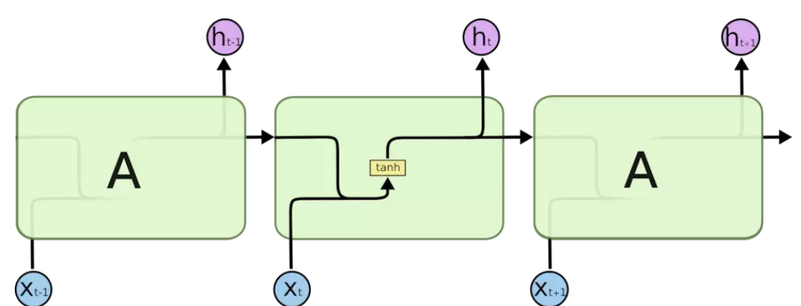
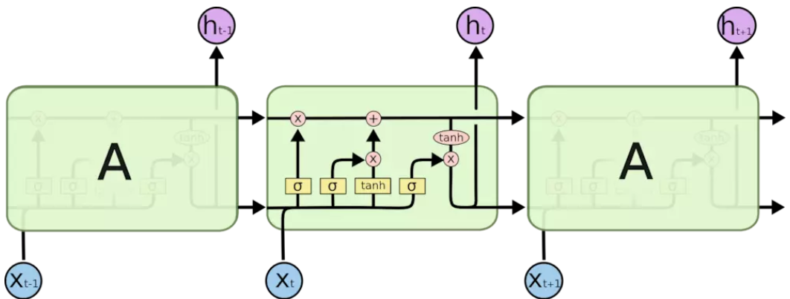

DEEP AUTO-ENCODING GAUSSIAN MIXTURE MODEL FOR UNSUPERVISED ANOMALY DETECTION
=============
DAGMM is a deep auto-encoder to generate a low-dimensional representation and reconstruction error for each input data point, jointly optimizes the parameters of the deep auto-encoder and the mixture model simultaneously. Below are gist of this paper.

- Construction
	- Compression network: 
		-  low-dimensional representations __zc = h(x;θe)__ by [deep auto-encoder](#auto-encoder) 
		- features __zr = f(x,x'), x' = g(zc;θd), __derived from reconstruction error
	- Estimation network: prediction by GMM

- Density estimation
Anomalies are those ones residing in low probability density areas. 

- Previous approaches 
Mainly suffer from decoupled model learning (two-stage training and the
standard Expectation-Maximization (EM) algorithm) with inconsistent optimization goals and incapability of preserving essential information in the low-dimensional space.

## Auto Encoder
Auto-encoder is a specific kind of Feed-forward neural network. Despite that other Feed-forward NN focus on the output layer and error rate, while auto-encoder focus on the hidden layer.

### Original Auto Encoder
- The dimensions of the Hidden Layer are much smaller than the Input Layer
- Output is used to reconstruct Input, which is to minimize the error L(Input, Output), with simple back propagation.

Using the vector of neurons in the Hidden Layer (here we call Code) to represent Input, it achieves the effect of Input compression.

Cons:
- Compression is only available for samples that are similar to training samples
- The ability to require encoder and decoder is not too strong. In extreme cases, they have the ability to fully remember the training samples, so it doesn't matter what Code is, let alone the compression capability?

### Sparse Auto Encoder (SAE)
Pros of Sparse:
- Dimensionality reduction
- Grasp the main features, anti-noise
- Interpretable usually follow Occam's Law of Razor

### Denoising AutoEncoder (DAE)
Add noise to the original sample and expect to use DAE to reduce the noisy sample to a pure sample.

### Other AutoEncoders
- Contrative AutoEncoder（CAE）： Modified the constraint of DAE
- Stacked AutoEncoder（SAE）: The single-layer AutoEncoder has been extended to propose a multi-layered AutoEncoder.
- Incorporating into the structure of a traditional FNN network ：
	- Convolutional Autoencoder
	- Recursive Autoencoder
	- LSTM Autoencoder

### Variational AutoEncoder （VAE）
Defining the problem: We want to learn a model that produces data that is not in the training sample but similar to the training set.

For the data x we ​​expect to acquire, there may be a specific relationship between the different dimensions. The factors corresponding to these links are extracted separately as features, namely Latent Variables, Writing z. Therefore VAE is an unsupervised generation model.

What the hidden variables z represent, and their corresponding expressions are difficult to define manually.

The author gives a very clever solution, that is, taking z \sim N(0,I), while f(z;\theta) uses multiple layers of DNN to learn. Of course, the real hidden variable cannot be a simple N(0,I). The clever thing is that due to any d-dimensional distribution, the d-dimensional Gaussian distribution can be obtained by some complex function transformation. Therefore, the multi-layer DNN corresponding to f(z;\theta) is responsible for mapping the z of the Gaussian distribution to the real hidden variable, and the latter layers are responsible for mapping this hidden variable to x.

If the hidden variable z dimension is large now, it will require a very large number of samples, which is almost impossible to calculate. However, it can be known from experience that for most z, p(x|z)=0 does not help to estimate p(x). So you only need to sample those z that contribute to p(x). At this point, you need to know p(z|x), but this cannot be directly obtained. In VAE, using Variational Inference, q(z|x) is introduced to approximate p(z|x).

### WAE
VAE also has disadvantages. When applied to natural images, images generated by VAE are usually blurred.

GANs can generate higher quality images, but without encoders, it is more difficult to train and suffers from “modal collapse”

WAE has the ability to generate image samples of better quality.

The goals of both VAE and WAE are minimized:

- Reconstruction loss function
- The difference between the distribution of the prior distribution PZ and the encoder Q (more precisely, a regularity that penalizes the difference)

For all different input samples x sampled from PX, VAE forces Q(Z | X = x) to match PZ, while WAE forces the continuous mixed distribution QZ to match the PZ. Therefore, the latent codes of different samples may be far apart from each other for better reconstruction.

__Reconstruction loss function__: Distance between two probability distributions -- f-divergences and optimal transport are mostly used, this one is based on OT.

__Regularity__: Based on GAN or MMD, in which MMD performs well on high-dimensional data that conforms to a normal distribution, and saves computational power compared to GAN-based approaches.

## LSTM
LSTM is developed to solve the long-term dependencies problem in RNN. LSTM avoids long-term dependencies by deliberate design without great extra computational price.

All RNNs have a chained form of a repetitive neural network module. In a standard RNN, this duplicate module has only a very simple structure, such as a tanh layer.

LSTM is also a structure like this, but duplicate modules have a different structure. Unlike a single neural network layer, there are four here, interacting in a very special way.

