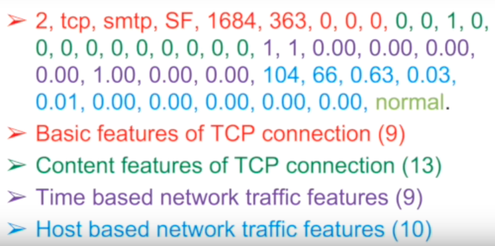
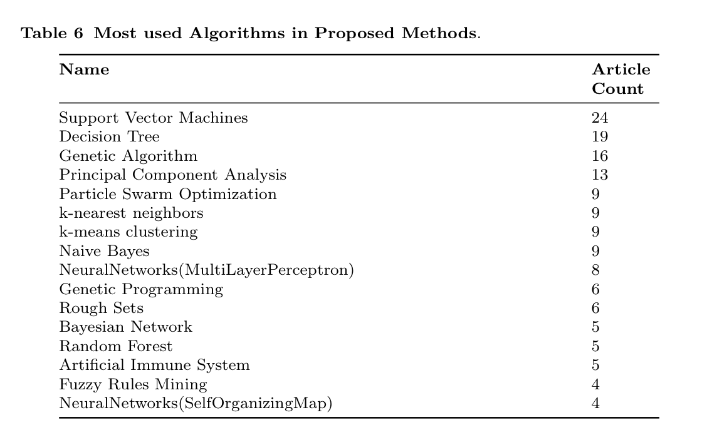
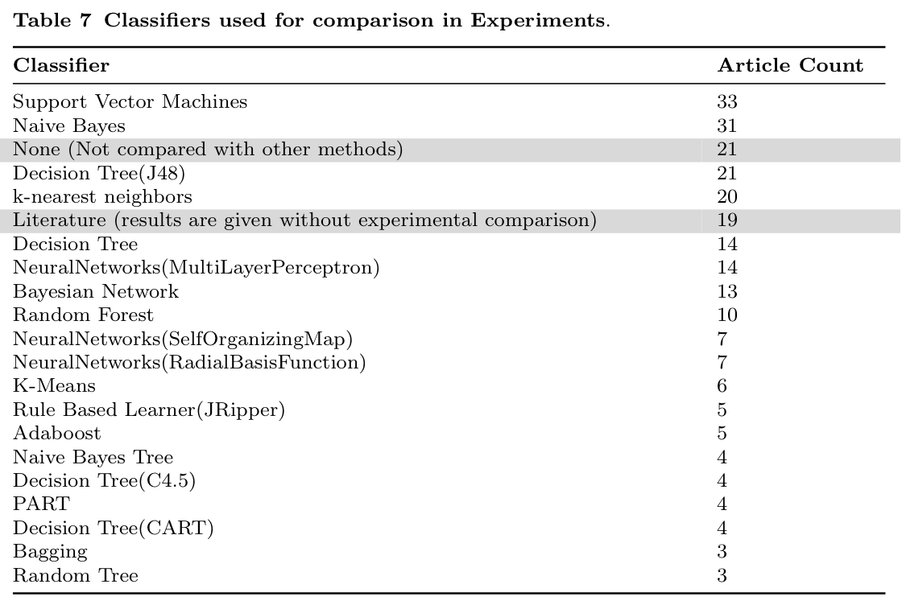
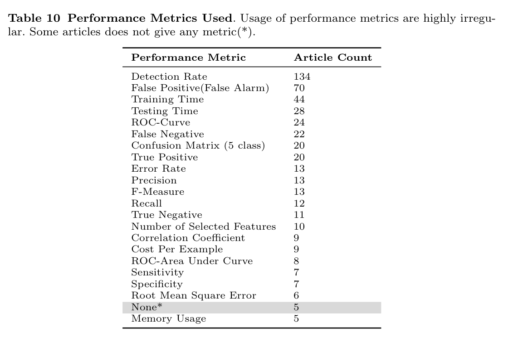

# KDD99 Computer Network Intrusion Detection
This is a comparision over several methods on the KDD99 dataset. 

For usage, go [there](#jump).

## DataSet
DARPA collected 9 weeks of TCPdump network connectivity and system audit data, simulating various user types, various network traffic and attack methods, with the 7-week's training data probably contains more than 5,000,000 network connection records, and the remaining 2 weeks of test data probably contains 2,000,000 network connection records.

Each network connection is marked as normal or abnormal. The exception type is subdivided into 4 types of 39 types of attacks. 22 types of attacks appear in the training set, and 17 unknown types of attacks appear in the test set. Besides, the test data is not from the same probability distribution as the training data.

The four types of anomalies are:
- DOS: denial-of-service
- R2L: unauthorized access from a remote machine to a local machine
- U2R: unauthorized access to local superuser privileges by a local unpivileged user
- PROBING: surveillance and probing

The whole DataSet can be found [here](http://www.kdd.org/kdd-cup/view/kdd-cup-1999/Data)

## Todo List
- ~Simple data pre-processing~
- ~Model selection~ 
- ~Train under the 10 percent KDD dataset~
- Evaluation
- Visualization
- Use MapReduce/Spark to train the whole dataset
- Improvements
- Generalize method

## Data pre-processing
### Original

Source comes from [Analyze KDD99 data set by Sean Han](https://www.youtube.com/watch?v=mm38R3NsHso)
### Steps
- Do the exploratory data analysis using `Pandas`
- Identify the target category by number
- Handle discrete features by One-hot encoding 
- Generate a new file in the data directory
- Note that there is an error data on the line 485798, remove before or it will break the training process.

## Models
Refer to the review of KDD99 dataset usage [1], these are the methods that are commonly used by researchers in proposed methods and for comparision.

 

Below are the Classifiers that I chose for comparision.
### SVM 
This should be the best performing method according to [the results of the KDD'99 Classifier Learning Contest](http://cseweb.ucsd.edu/~elkan/clresults.html), but it didn't perform well under the 10 percent dataset. 

Parameters refer to [glglgithub](https://github.com/glglgithub/CyberSecurity-A-Study-with-KDD99-Dataset).

Below is information of the SVM model trained on the 10 percent dataset:

SVC(C=1, cache_size=200, class_weight=None, coef0=0.0,
  decision_function_shape='ovo', degree=3, gamma='auto', kernel='linear',
  max_iter=-1, probability=False, random_state=93, shrinking=True,
  tol=0.001, verbose=True): 

number of labels: 5
, cache size: 200
, expected number of classes under one-vs-one model: 10
, number of decisions from the model based on 'ovo': 10

- training time: 136.18 seconds
- accuracy based on training: 0.9978
- accuracy based on testing: 0.8469
	
### Decision Tree
DecisionTreeClassifier(class_weight=None, criterion='gini', max_depth=None,max_features=None, max_leaf_nodes=None,min_impurity_decrease=0.0, min_impurity_split=None,min_samples_leaf=1, min_samples_split=2,min_weight_fraction_leaf=0.0, presort=False, random_state=None,splitter='best'):

- training time: 1.95 seconds
- accuracy based on training: 1.0000
- accuracy based on testing: 0.9255

### k-nearest neighbors
Only one neighbor gets good results but still slow.

KNeighborsClassifier(algorithm='auto', leaf_size=30, metric='minkowski',metric_params=None, n_jobs=1, n_neighbors=1, p=2,weights='uniform'):

- training time: 1137.91 seconds
- accuracy based on training: 1.0000
- accuracy based on testing: 0.9185

### Naive Bayes 
Bad Accuracy.

GaussianNB(priors=None):

- training time: 0.41 seconds
- accuracy based on training: 0.8816
- accuracy based on testing: 0.7293

### Neural Networks (MLP)
Parameters refer to [PENGZhaoqing](https://github.com/PENGZhaoqing/kdd99-scikit).

MLPClassifier(activation='relu', alpha=1e-05, batch_size='auto', beta_1=0.9,beta_2=0.999, early_stopping=False, epsilon=1e-08,hidden_layer_sizes=(10, 6), learning_rate='constant',learning_rate_init=0.001, max_iter=200, momentum=0.9,nesterovs_momentum=True, power_t=0.5, random_state=1, shuffle=True,solver='adam', tol=0.0001, validation_fraction=0.1, verbose=False, warm_start=False):

- training time: 22.02 seconds
- accuracy based on training: 0.9984
- accuracy based on testing: 0.9221

### Random Forest
Adjust parameters using `GridSearch`

	from sklearn.ensemble import RandomForestClassifier
	from sklearn.grid_search import *
	rfc = RandomForestClassifier(n_jobs=-1)
	parameters = {#'n_estimators': tuple(range(10, 50, 10)),  # overfit if too large, underfit if too small
				  #'n_estimators': [5, 10, 20, 35],  
				   'n_estimators': [6, 7, 8, 9, 10],
	               'criterion': ["entropy"]}
	gscv = GridSearchCV(rfc, parameters,cv=3,verbose=2,refit=False,n_jobs=1)
	gscv.fit(X_train_trans, y_train)
	print("optimization params:",gscv.best_params_['n_estimators'],gscv.best_params_['criterion'])
	print("grid search finished")

RandomForestClassifier(bootstrap=True, 
			class_weight=None, criterion='entropy',
            max_depth=None, max_features='auto', max_leaf_nodes=None,
            min_impurity_decrease=0.0, min_impurity_split=None,
            min_samples_leaf=1, min_samples_split=2,
            min_weight_fraction_leaf=0.0, n_estimators=8, n_jobs=1,
            oob_score=False, random_state=None, verbose=0,
            warm_start=False):

- training time: 1.66 seconds
- accuracy based on training: 0.9999
- accuracy based on testing: 0.9219

## Evaluation
The review [1] shows the usage of perform metrics

### Indicators

### Results

### Reason Analysis

## Improvements
### Use NSL DataSet [2]
- Remove duplicated data
- Remove the easiest data
- Reduce bias on normal and dos attack

### Reduce data demension
- PCA (Not perform well on this DataSet!)
- Feature selection : Use Information Coefficient to judge the degree of association (21 out of 42)
- K-means : model extraction (find each specific attack a best model)

### Avoid overfitting
- Cross validation : Only 21% of the studies from 2010 to 2015 applied cross validation [1]
- Normalization : Euclidean distance

##  Usage 
### Prerequisite

## Reference
[1] Özgür, Atilla and Hamit Erdem. “A review of KDD99 dataset usage in intrusion detection and machine learning between 2010 and 2015.” PeerJ PrePrints 4 (2016): e1954.

[2] M. Tavallaee, E. Bagheri, W. Lu, and A. Ghorbani, “A Detailed Analysis of the KDD CUP 99 Data Set,” Submitted to Second IEEE Symposium on Computational Intelligence for Security and Defense Applications (CISDA), 2009.

[3] K. Ibrahimi and M. Ouaddane, "Management of intrusion detection systems based-KDD99: Analysis with LDA and PCA," 2017 International Conference on Wireless Networks and Mobile Communications (WINCOM), Rabat, 2017, pp. 1-6

